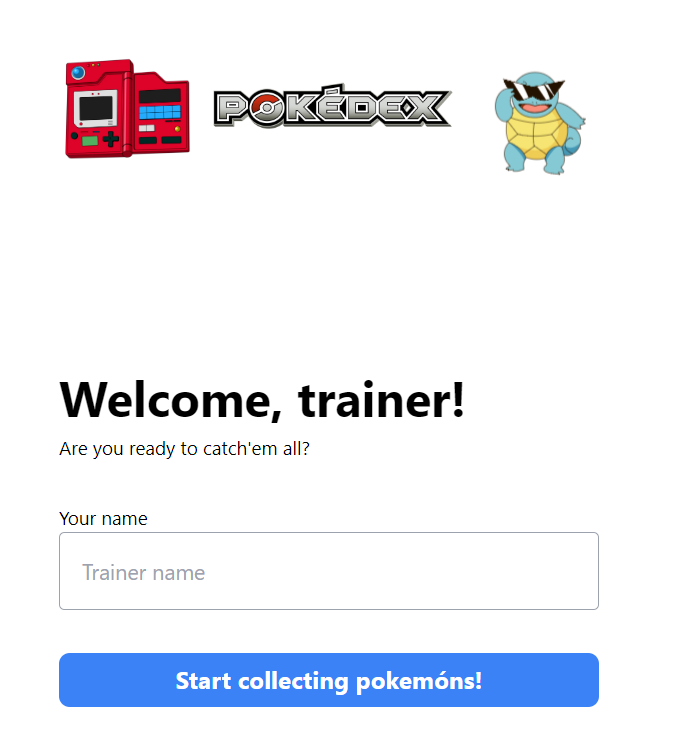
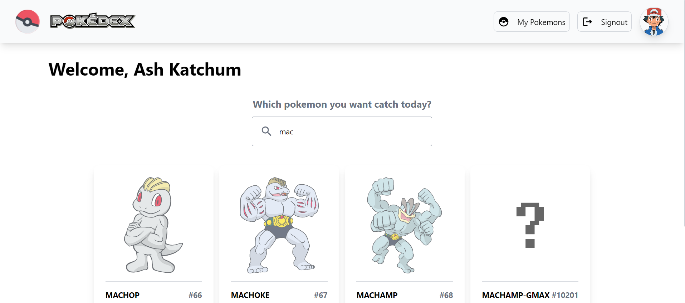
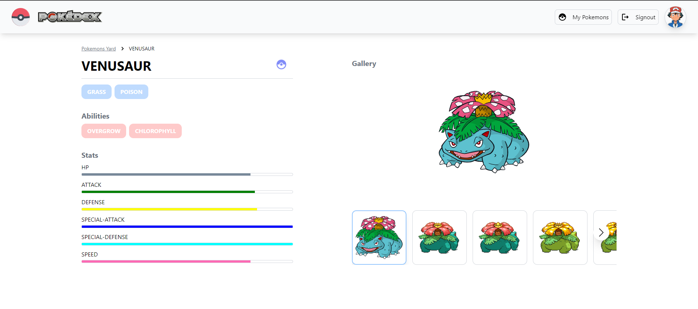
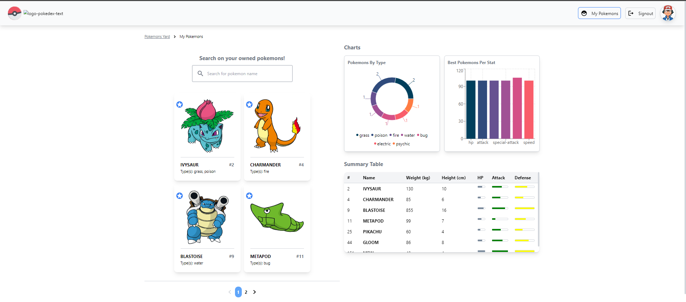

# CI&T Tech Challenge - Pokédex App

This app is an implementation of a Pokédex using React and Poke API (https://pokeapi.co/). A pokémon trainer can signin, search for pokémons and catch them to their personal collection. Trainers also have a dashboard page, where they can search through their pokémons and visualize them in different data visualization tools (charts and table). Also, each pokémon has its own details page, with their main attributes and stats, and also a carousel-like gallery with their available pictures.

## Running the project

- Clone this repo in tour local machine by running

`git clone https://github.com/charlesaguiar/ciandt_react_challenge.git`

- This repo has several branches, representing the features added along the way. The **main** branch is `origin/develop`, which contains the most updated code. After cloning the repo, run

`npm install`

to download and install all dependencies.

- The environment variables are already contained in the `.env` file, which has been versioned in the repo too.

### Code formatting

This project uses ESLINT and Prettier to provide code formatting. You can run `npm run lint` or `npm run lint:fix` to lint the code.

### Unit testing

This project uses Jest alongside with react-testing-library for unit testing. Run

`npm run test`

to run the tests for the files changed recently; or, run

`npm run test --watchAll`

to run all available tests. You can also run `npm run test:coverage` to run all tests and get a coverage report, which is around 50% right now.

### Git hooks

This project also has git-hooks run by Husky and CommitLint. There is a commit message validator to enforce the _Conventional Commit_ standards. See the `commitlint.config.js` file for details. Also, there is a pre-commit validator, that enforces no ESLINT problems before commits.

## Used technologies:

- React 18;
- [React-Router-Dom v6](https://reactrouter.com/en/main) for routing;
- [TailwindCSS](https://tailwindcss.com/) for styling;
- [Axios](https://axios-http.com/docs/intro) for HTTP requests;
- [React-Query](https://react-query-v3.tanstack.com/) for data fetching;
- [React-Table](https://tanstack.com/table/v8/) for building tables;
- [ReCharts](https://recharts.org/en-US/) for data plotting;
- [Jest](https://jestjs.io/pt-BR/)/[RTL](https://testing-library.com/docs/react-testing-library/intro/) for unit testing.

## Screenshots

- Signin
  
- Homepage
  
- Pokémon Details
  
- My Pokémons
  
